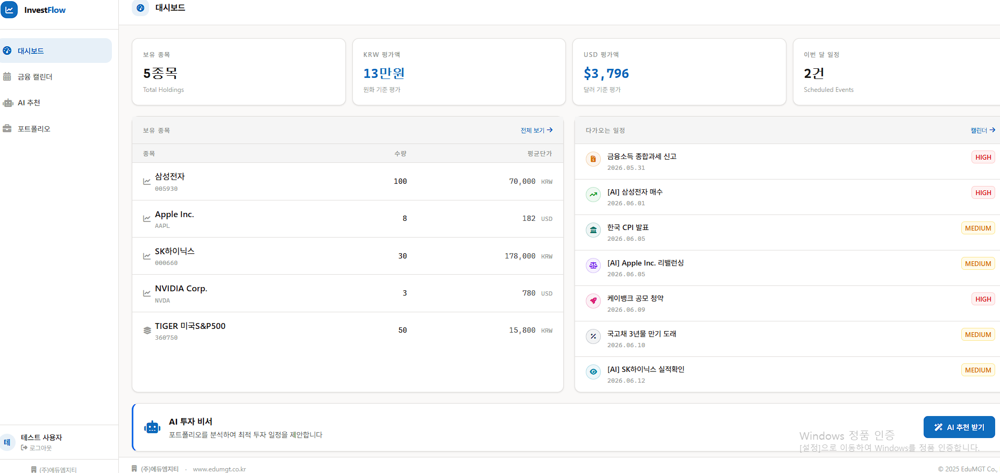
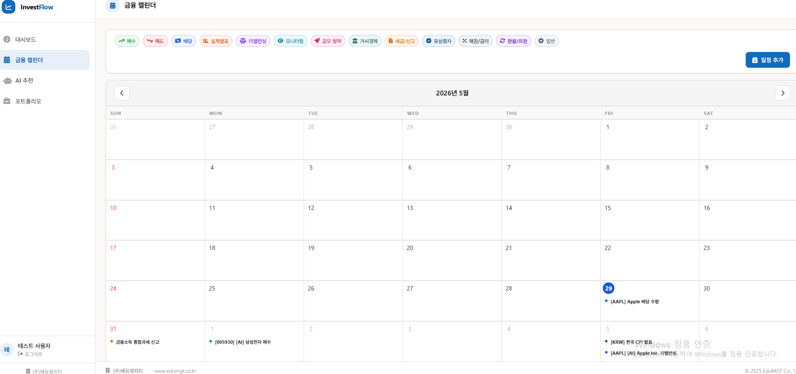
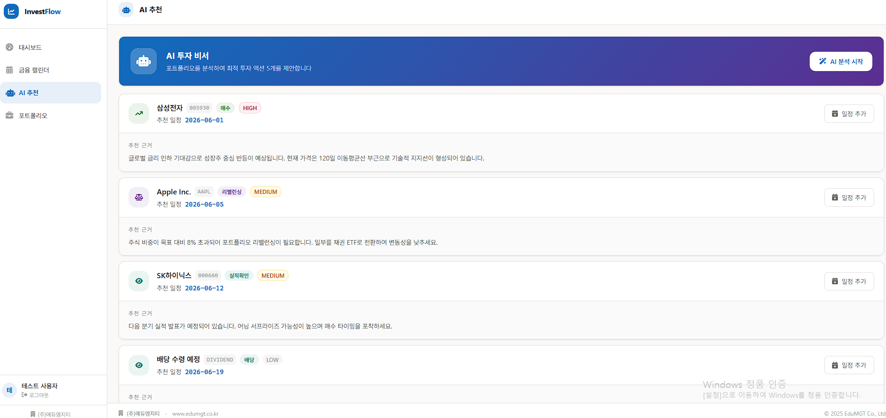
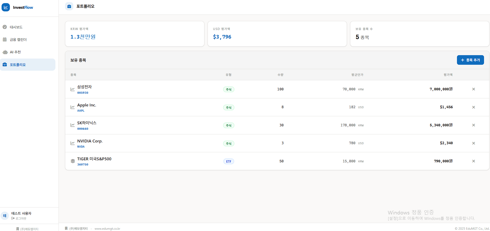

# InvestFlow
 
> **AI 기반 개인 투자 일정 관리 웹앱** — Vue 3 · Node.js · PostgreSQL · Claude AI

[](https://vuejs.org)
[](https://nodejs.org)
[](docker-compose.yml)
[](https://anthropic.com)
[](LICENSE)

**InvestFlow**는 개인 투자자를 위한 AI 비서 웹앱입니다.  
보유 포트폴리오를 관리하고, AI(Claude)가 분석하여 매수·매도·리밸런싱 일정을 자동으로 제안합니다.  
제안된 일정은 컬러 코드 투자 캘린더에 바로 등록할 수 있습니다.

---










---

# [AI 기반 금융솔루션 개발 관점] CRGR 프레임워크 기반 파이프라인

## 1. 개요
금융 분야에서 AI는 신용평가 고도화, 이상거래탐지(FDS), 로보어드바이저, 대출 심사 자동화 등에 핵심적으로 사용됩니다. 엄격한 보안과 고도의 정확성이 요구되는 금융 솔루션 개발에서 CRGR 프레임워크는 데이터 파이프라인의 안정성과 규제 준수(Compliance)를 확보하는 이정표 역할을 합니다.

---

## 2. 단계별 세부 내용

### 1) Collect (금융 데이터 수집)
* **금융 솔루션적 정의:** AI의 예측 정확도를 높이기 위해 정형·비정형 금융 원천 데이터를 안전하게 확보하는 단계입니다.
* **주요 수집 데이터:**
  * **내부 데이터:** 계좌 잔고, 거래 내역, 신용카드 결제 이력, 대출 상환 이력 등.
  * **외부/대안 데이터:** 마이데이터(MyData)를 통한 타사 금융 정보, 통신료 납부 내역, 이커머스 구매 패턴, 뉴스 및 공시 자료(STT/텍스트).
* **핵심 고려사항:** 망분리 규제, 신용정보법 및 개인정보보호법을 준수하여 적법한 절차로 데이터를 수집해야 합니다.

### 2) Refine (데이터 정제 및 컴플라이언스 필터링)
* **금융 솔루션적 정의:** 금융 데이터 특유의 노이즈를 제거하고 가치 있는 피처(Feature)를 추출하며, 법적 규제에 맞게 정제하는 필수 단계입니다.
* **주요 활동:**
  * **가명·익명 처리:** 개인을 식별할 수 있는 정보(주민등록번호, 전화번호 등)를 완벽하게 비식별화.
  * **결측치 및 이상치 처리:** 시스템 오류로 누락된 거래 기록 보정, 데이터 스케일링(Scaling).
  * **라벨링(Labeling):** 이상거래탐지(FDS) AI 학습을 위해 과거 사기(Fraud) 사례 데이터를 명확히 태깅하는 작업.

### 3) Group (다차원 금융 가치 결합 및 가치화)
* **금융 솔루션적 정의:** 이종(異種) 데이터를 결합하여 금융 소비자의 신용 및 투자 성향을 다각도로 분석하고 AI 모델용 데이터셋을 구조화하는 단계입니다.
* **주요 활동:**
  * **데이터 결합(Data 융합):** 전통적 금융 정보(신용점수)와 대안 데이터(통신료/소비 성향)를 결합하여 신용평가 모형(CSS)을 고도화.
  * **벡터화 및 지식 그래프화:** 로보어드바이저 및 금융 시장 분석 LLM이 거시경제 지표, 기업 공시, 시장 트렌드를 빠르게 연동하여 이해할 수 있도록 벡터 DB에 그룹화하여 저장.

### 4) Reuse (금융 솔루션 전개 및 비즈니스 재사용)
* **금융 솔루션적 정의:** 구축된 고품질 데이터셋과 AI 인프라를 바탕으로 다양한 금융 상품 및 서비스에 확장 적용하여 부가가치를 극대화하는 단계입니다.
* **주요 활용 시나리오:**
  * **원소스 멀티유즈(OSMU):** 정제·결합된 고객 성향 분석 데이터를 '맞춤형 자산관리 챗봇', '타깃 마케팅 엔진', '대출 한도 산정 시스템' 등 사내 다양한 AI 솔루션에 공유 및 재사용.
  * **지속적 학습(Continuous Learning):** AI 금융 솔루션을 이용하면서 발생하는 실시간 거래 피드백 데이터를 다시 1단계(Collect)로 재투입하여, 급변하는 금융 시장 트렌드와 새로운 사기 패턴에 AI가 실시간으로 대응하도록 아키텍처를 구성.

## 주요 기능

| 기능 | 설명 |
|------|------|
| **대시보드** | 포트폴리오 요약, 다가오는 투자 일정, AI 추천 바로가기 |
| **투자 캘린더** | 매수·매도·배당·실적발표·리밸런싱을 컬러별로 구분 표시 |
| **AI 추천** | Claude AI가 포트폴리오 분석 후 5개 투자 액션 일정 제안 |
| **포트폴리오 관리** | 보유 종목(주식·ETF·채권·암호화폐·리츠) CRUD |

## 스택

| 레이어 | 기술 |
|--------|------|
| Frontend | Vue 3 + Vite + TypeScript + Tailwind CSS + TUI Calendar |
| Backend | Node.js (ESM, no framework) + JWT (HMAC-SHA256) |
| Database | PostgreSQL 16 + pgcrypto |
| AI | Anthropic Claude API (claude-sonnet-4-6) |
| DevOps | Docker Compose + GitLab CI + Apache Airflow |

---

## 빠른 시작 (Docker)

```bash
cp .env.example .env
# .env 에서 ANTHROPIC_API_KEY 입력 (선택 — 없으면 목 데이터로 동작)

docker compose up --build -d
```

- **Frontend**: http://localhost:5173
- **Backend**: http://localhost:3000/health

DB 초기화 후 재시작:

```bash
docker compose down -v
docker compose up --build -d
```

---

## 로컬 개발 (비도커)

### 1) Frontend

```bash
npm install
npm run dev
```

### 2) Backend

```bash
cd backend
cp ../.env.example .env
npm install
npm run dev
```

---

## 테스트 계정

| 계정 | 비밀번호 | 포트폴리오 |
|------|----------|-----------|
| `alice` | `Passw0rd!` | 삼성전자·SK하이닉스·TIGER S&P500·AAPL·KODEX200 |
| `bob`   | `Passw0rd!` | NVIDIA·나스닥100 ETF·BTC |
| `carol` | `Passw0rd!` | (비어있음 — 직접 추가 테스트용) |

---

## AI 추천 흐름

```
사용자 → [AI 추천] 탭 → "AI 분석 시작" 클릭
     → POST /api/ai/recommend
     → 백엔드: DB에서 포트폴리오 조회
     → Claude API 호출 (ANTHROPIC_API_KEY 미설정 시 목 데이터)
     → 5개 투자 액션 + 추천 날짜 반환
     → 사용자: 개별 or 전체 "캘린더에 추가"
     → 투자 캘린더에 AI 추천 이벤트 등록
```

---

## API 엔드포인트

| Method | URL | 설명 |
|--------|-----|------|
| POST | `/api/auth/login` | JWT 로그인 |
| GET | `/api/investments` | 포트폴리오 조회 |
| POST | `/api/investments` | 종목 추가 |
| DELETE | `/api/investments/:id` | 종목 삭제 |
| GET | `/api/calendar/events` | 투자 이벤트 목록 |
| POST | `/api/calendar/events` | 이벤트 추가 |
| DELETE | `/api/calendar/events/:id` | 이벤트 삭제 |
| POST | `/api/ai/recommend` | AI 투자 일정 추천 |

---

## 이벤트 유형 & 컬러

| 유형 | 컬러 | 의미 |
|------|------|------|
| 매수 | 초록 | 주식/ETF 매수 예정 |
| 매도 | 빨강 | 매도·수익실현 예정 |
| 배당 | 파랑 | 배당금 수령일 |
| 실적발표 | 주황 | 어닝 시즌 모니터링 |
| 리밸런싱 | 보라 | 포트폴리오 리밸런싱 |
| 모니터링 | 청록 | 목표가·조건 모니터링 |
| 일반 | 회색 | 기타 투자 메모 |

---

## DevOps (선택)

- **GitLab CI**: `.gitlab-ci.yml` — 빌드·테스트·배포 파이프라인
- **Airflow**: `docker-compose.airflow.yml` — 정기 파이프라인 트리거
- **이중 Push**: `scripts/setup-dual-remote.sh` — GitHub ↔ GitLab 동기화


---

# GPU 가상화 및 베어메탈(Bare-Metal) 환경 이해하기

본 문서는 윈도우 호스트 환경에서 가상머신(VMware, VirtualBox)의 GPU 활용 한계와 이를 극복하기 위한 베어메탈(Bare-Metal) 리눅스 환경의 개념, 장단점 및 대안을 정리한 가이드입니다.

---

## 1. 가상머신(VMware / VirtualBox)에서의 GPU 사용

기존 윈도우 PC 호스트 위에서 가상머신을 구동할 때 GPU 지원 방식은 크게 **API 가속(가상 GPU)** 방식으로 제한됩니다.

### 1) 기본 지원 방식: API 가속 (가상 GPU)
두 프로그램 모두 호스트의 GPU 자원을 가상머신이 나누어 쓸 수 있도록 **3D 그래픽 가속** 기능을 제공합니다.
* **원리:** 가상머신 내에 가상의 그래픽 드라이버를 설치하고, 가상머신이 요청하는 그래픽 명령(DirectX나 OpenGL)을 호스트의 실제 GPU로 전달하여 처리하는 방식입니다.
* **용도:** 윈도우 UI의 부드러운 움직임, 간단한 3D 프로그램 실행, 캐주얼 게임 등.
* **한계:** * **VirtualBox:** 최근 버전에서 3D 가속 기능(가상 그래픽 카드 `vmsvga` 등)을 지원하지만, 성능이 뛰어나지 않고 드라이버 안정성 문제가 종종 발생합니다.
  * **VMware Workstation:** VirtualBox보다는 3D 가속 성능과 호환성(DirectX 11 등 지원)이 훨씬 뛰어납니다.

### 2) 물리 GPU 직결(GPU Passthrough)의 한계
가상머신에서 **NVIDIA CUDA를 활용한 AI 딥러닝 학습, VR, 혹은 고사양 게임**을 구동하려면 호스트의 물리 그래픽카드를 가상머신에 통째로 넘겨주는 **GPU Passthrough** 기술이 필요합니다. 
그러나 **윈도우 호스트 + VMware Workstation / VirtualBox 조합에서는 이 기능을 공식적으로 사용할 수 없습니다.**
* **VirtualBox:** 과거 PCI Passthrough 실험적 기능이 있었으나, 윈도우 호스트에서는 설정이 극도로 어렵거나 사실상 불가능합니다.
* **VMware Workstation:** 개인용/사무용 프로그램이기 때문에 GPU Passthrough를 지원하지 않습니다. (기업용 제품인 VMware ESXi에서만 지원)

---

## 2. 베어메탈(Bare-Metal)의 개념

**'베어메탈(Bare-Metal)'**은 직역하면 '맨 금속'이라는 뜻으로, **하드웨어(CPU, GPU, RAM 등) 위에 가상화 레이어나 윈도우 같은 다른 OS 없이, 곧바로 대상 OS(리눅스 등)를 설치하여 사용하는 환경**을 의미합니다. 

일반적인 PC에 리눅스를 멀티 부팅(Dual Boot)이나 단독 부팅으로 설치하여 사용하는 형태가 바로 베어메탈 환경입니다.

### 1) 장점 (GPU 사용 관점)
* **손실 없는 100% 성능 발휘:** 가상머신처럼 중간에서 명령어를 번역하거나 자원을 가르는 오버헤드가 전혀 없습니다. 그래픽카드의 연산 능력을 100% 온전하게 뽑아낼 수 있습니다.
* **완벽한 드라이버 지원 (NVIDIA CUDA):** AI 딥러닝(TensorFlow, PyTorch)이나 LLM 학습 등을 할 때 리눅스 환경이 표준입니다. 베어메탈 리눅스에서는 NVIDIA 공식 드라이버와 CUDA 툴킷이 충돌 없이 가장 안정적으로 작동합니다.
* **vRAM(그래픽 메모리) 온전한 활용:** 가상머신에서는 호스트와 게스트가 메모리를 나누어 쓰느라 제약이 많지만, 베어메탈에서는 GPU에 탑재된 vRAM 전체를 하나의 작업에 통째로 몰아줄 수 있습니다.

### 2) 단점 및 고려사항
* **멀티태스킹의 불편함:** PC에 리눅스만 단독 설치하면 기존에 사용하던 윈도우 전용 프로그램(MS 오피스, 한글, 윈도우 전용 게임 등)을 사용할 수 없습니다.
* **백업 및 복구의 어려움:** 가상머신은 '스냅숏' 기능으로 마우스 클릭 한 번에 과거 상태로 돌릴 수 있지만, 베어메탈 리눅스는 드라이버가 꼬이거나 OS가 깨지면 포맷 후 처음부터 다시 설치해야 할 수 있습니다.
* **초기 드라이버 설정 난이도:** 우분투(Ubuntu) 같은 대중적인 리눅스는 많이 편해졌지만, 가끔 그래픽 드라이버 설치 과정에서 검은 화면(블랙스크린)이 뜨는 등 진입장벽이 존재합니다.

---

## 3. 요약 및 목적별 추천 대안

| 목적 | 추천 환경 | 특징 |
| :--- | :--- | :--- |
| **간단한 화면 그래픽 가속 및 리눅스 실습** | **VMware Workstation** | `Accelerate 3D graphics` 옵션을 켜고 가상 그래픽 메모리를 할당하여 편리하게 사용 가능 |
| **윈도우를 유지하면서 AI 학습 및 CUDA 활용** | **WSL2 (Windows Subsystem for Linux)** | 마이크로소프트가 커스텀한 가상화 기술로, 예외적으로 호스트 NVIDIA GPU(CUDA) 성능을 거의 그대로 공유 가능 |
| **헤비한 AI 연구, 딥러닝, 대규모 GPU 연산** | **베어메탈 리눅스 (또는 듀얼 부팅)** | 하드웨어 성능을 100% 활용할 수 있는 최적의 환경. 기존 윈도우를 남기려면 SSD를 분할하여 멀티 부팅 구성을 추천 |
